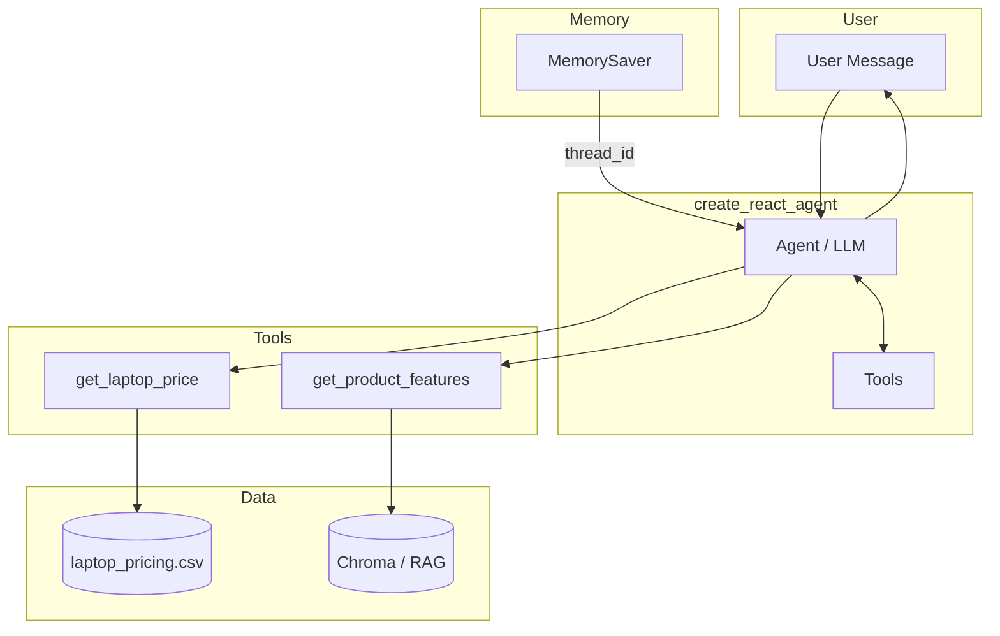

# Product QnA Chatbot — Summary

> **ReAct agent** with RAG (product features) + pricing tool (CSV) + conversation memory (MemorySaver).

**Files:** [`langgraph_examples/Product QnA Agent.ipynb`](langgraph_examples/Product%20QnA%20Agent.ipynb) | [`langgraph_examples/example8_product_qna_agent.py`](langgraph_examples/example8_product_qna_agent.py)

---

## Architecture Diagram

```
┌─────────────────────────────────────────────────────────────────────────────────┐
│                         PRODUCT QnA CHATBOT ARCHITECTURE                         │
└─────────────────────────────────────────────────────────────────────────────────┘

                              ┌──────────────┐
                              │    USER      │
                              └──────┬───────┘
                                     │ messages
                                     ▼
┌──────────────────────────────────────────────────────────────────────────────────┐
│  create_react_agent (ReAct loop)                                                   │
│  ┌─────────────────────────────────────────────────────────────────────────────┐ │
│  │  AGENT (LLM)                                                                  │ │
│  │  • Reasons about user question                                                │ │
│  │  • Decides: call tool(s) or respond directly (small talk)                     │ │
│  │  • Synthesizes final answer from tool results                                  │ │
│  └───────────────────────────────┬───────────────────────────────────────────────┘ │
│                                  │ tool_calls                                       │
│                                  ▼                                                 │
│  ┌─────────────────────────────────────────────────────────────────────────────┐ │
│  │  TOOLS                                                                        │ │
│  │  ┌─────────────────────────┐    ┌─────────────────────────────────────────┐   │ │
│  │  │ get_laptop_price        │    │ get_product_features (RAG)              │   │ │
│  │  │ • Substring match       │    │ • Vector search over descriptions        │   │ │
│  │  │ • Returns price or -1   │    │ • Returns top-k relevant chunks          │   │ │
│  │  └───────────┬─────────────┘    └──────────────────┬──────────────────────┘   │ │
│  └──────────────┼──────────────────────────────────────┼──────────────────────────┘ │
└─────────────────┼──────────────────────────────────────┼────────────────────────────┘
                  │                                     │
                  ▼                                     ▼
        ┌─────────────────┐                 ┌─────────────────────────┐
        │ laptop_pricing   │                 │ Chroma (vector store)    │
        │ .csv             │                 │ • laptop_descriptions.txt│
        │ Name,Price,...   │                 │ • Chunked + embedded     │
        └─────────────────┘                 └─────────────────────────┘

┌──────────────────────────────────────────────────────────────────────────────────┐
│  MEMORY (MemorySaver + thread_id)                                                 │
│  • Same thread_id  → same conversation history ("How much does it cost?" works)   │
│  • Different thread_id → separate users (USER 1: SpectraBook, USER 2: GammaAir)   │
└──────────────────────────────────────────────────────────────────────────────────┘
```

---

## Mermaid Diagram (for GitHub / Mermaid renderers)



---

## What We Built

| Component | Implementation |
|-----------|----------------|
| **Agent** | `create_react_agent(model, tools, state_modifier, checkpointer)` |
| **Pricing tool** | `@tool` + pandas CSV lookup, substring match |
| **RAG tool** | TextLoader → RecursiveCharacterTextSplitter → Chroma → `create_retriever_tool` |
| **Memory** | `MemorySaver()` checkpointer; `thread_id` in config |
| **Data** | `data/laptop_pricing.csv`, `data/laptop_descriptions.txt` |

---

## Flow Summary

1. **User asks** (e.g. "What are the features and pricing for GammaAir?")
2. **Agent reasons** — May call both `get_product_features` and `get_laptop_price` in one turn
3. **Tools execute** — RAG retrieves chunks; pricing tool looks up CSV
4. **Agent synthesizes** — Combines results into a natural answer
5. **Multi-turn** — Same `thread_id` = "How much does it cost?" refers to last laptop
6. **Multi-user** — Different `thread_id` = separate conversations per user

---

## Run

```bash
pip install pandas langchain-community langchain-chroma langchain-text-splitters
python langgraph_examples/example8_product_qna_agent.py
```

Or open [`langgraph_examples/Product QnA Agent.ipynb`](langgraph_examples/Product%20QnA%20Agent.ipynb) and run the cells.
